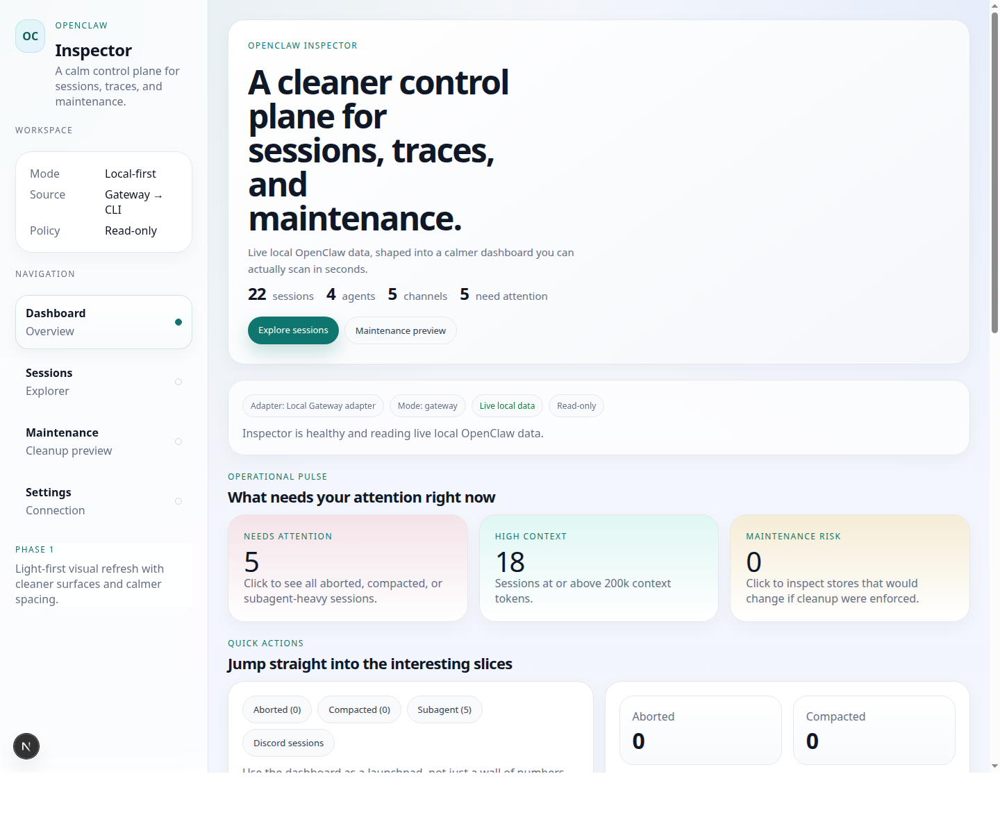

<p align="center">
  
</p>

<h1 align="center">OpenClaw Inspector</h1>

<p align="center">
  <strong>A local-first observability dashboard for OpenClaw.</strong>
</p>

<p align="center">
  Inspect sessions, tool traces, transcript search, maintenance health, and data-source routing from a UI that feels like a product instead of a pile of logs.
</p>

<p align="center">
  
  
  
  
</p>

---

## What is it?

OpenClaw already has strong runtime primitives:

- sessions
- transcripts
- tool calls and results
- compaction
- subagents
- cleanup / maintenance
- Gateway-backed routing

What it did not have was a **clean visual control surface**.

**OpenClaw Inspector** is that missing layer.

It helps you:

- **see** what happened in a session
- **debug** tool activity and transcript flow
- **spot** store health issues quickly
- **search** across recent transcripts
- **switch** between local and remote data sources without touching CLI flags every time

In short:

> OpenClaw runs the agents. OpenClaw Inspector helps humans make sense of them.

---

## Preview



---

## Why it is interesting

A lot of AI dashboards stop at vanity metrics.

OpenClaw Inspector is trying to be useful for people actually operating agents.

### Session-first, not demo-first
The core object is the **session**:

- what the user asked
- what tools ran
- how the transcript evolved
- where context went
- what likely got weird

### Local-first, remote-ready
You can run the UI locally and still point it at a **remote OpenClaw Gateway**.

That means this setup works:

- browser/UI on your laptop
- OpenClaw Gateway on a server or another machine

### Honest source visibility
The UI makes it obvious whether the current data is coming from:

- local Gateway
- local CLI
- remote Gateway
- mock fallback

### Maintenance that says something useful
Instead of hiding cleanup behind a dry-run command, the app surfaces:

- store health
- mutation pressure
- missing references
- per-agent cleanup hotspots

---

## Current feature set

### Dashboard
- attention-oriented summary cards
- context-heavy session views
- channel mix / kind mix
- maintenance pulse and health ratios

### Sessions Explorer
- real session listing
- client-side filters and search
- pagination
- state pills and richer metadata badges

### Session Detail
- transcript view
- tool trace view
- stats view
- export actions
- model snapshot insights
- search-focused jump-to-message flows

### Search
- transcript search across recent sessions
- paginated results
- direct jump into matching transcript entries

### Maintenance
- session store health dashboard
- cleanup dry-run analytics
- per-agent store breakdown

### Settings
- local Gateway / local CLI / mock modes
- **remote Gateway support** via URL + token/password
- runtime health cards showing what is actually reachable

---

## Data source modes

Inspector currently supports these read modes:

- **Auto local**
  - local Gateway → local CLI → mock
- **Local Gateway**
- **Local CLI**
- **Remote Gateway**
  - `ws://` or `wss://`
  - token or password
- **Mock**
  - useful for UI development, demos, and screenshots

**Note:** Maintenance is still local-only because cleanup dry-runs execute on the machine running Inspector.

---

## Quickstart

### Requirements

- Node.js 22+
- an OpenClaw environment available locally **or** a reachable remote Gateway

### Run locally

```bash
cd web
npm install
npm run dev
```

Open:

- `http://localhost:3000`

### Production build

```bash
cd web
npm run build
npm run start
```

---

## Repo structure

```text
openclaw-inspector/
├── docs/
│   ├── assets/
│   ├── ARCHITECTURE.md
│   ├── FEATURES.md
│   ├── MVP.md
│   ├── PRD.md
│   ├── ROADMAP.md
│   └── TASKS.md
├── LICENSE
├── README.md
└── web/
    ├── app/
    ├── components/
    ├── lib/
    ├── package.json
    └── ...
```

Useful docs:

- `docs/PRD.md` — product intent
- `docs/FEATURES.md` — feature inventory
- `docs/MVP.md` — first useful release boundary
- `docs/ARCHITECTURE.md` — integration model and adapter seams
- `docs/ROADMAP.md` — delivery phases

---

## Design principles

- **Read-only by default**
- **Make one session deeply understandable**
- **Tell the truth about the current data source**
- **Prefer operational clarity over shiny nonsense**
- **Local-first now, remote-ready when it matters**

---

## Roadmap direction

Near-term priorities:

- sharpen the dashboard further
- improve search UX
- keep polishing session debugging flows
- continue improving maintenance and settings
- make the inspector feel unmistakably product-grade

Later directions:

- safe action layer
- live observability
- multi-Gateway / team workflows
- deeper lineage / topology stories where they genuinely add value

---

## Contributing

Still early, so the most useful contributions are usually:

- bug reports with screenshots or reproduction steps
- UX feedback on confusing surfaces
- ideas for better debugging flows
- improvements to the source-mode and maintenance story

Good issue prompt:

> What did you expect to understand in 5 seconds, and what blocked that?

---

## License

[MIT](./LICENSE)

---

## Final pitch

If OpenClaw is the runtime,
**OpenClaw Inspector is the glass panel.**
