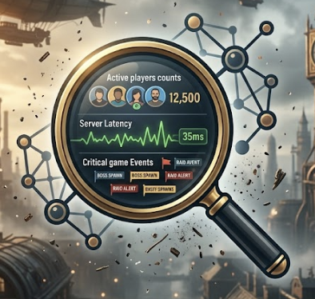
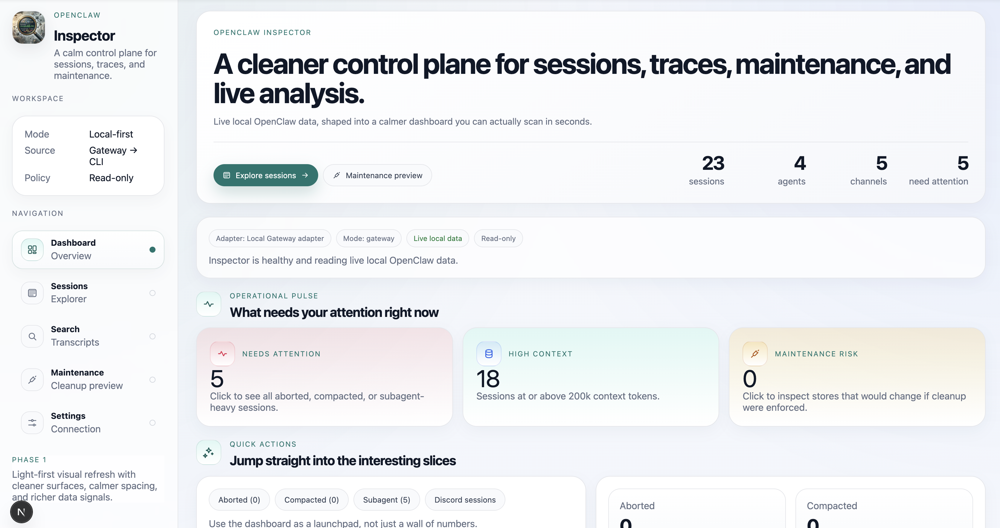

<p align="center">
  
</p>

<h1 align="center">OpenClaw Inspector</h1>

<p align="center">
  <a href="./README.md">English</a> · <a href="./README.zh-CN.md">简体中文</a>
</p>

<p align="center">
  <strong>一个面向 OpenClaw 的本地优先可观测性面板。</strong>
</p>

<p align="center">
  把 sessions、tool traces、transcript search、maintenance health 和 data source routing 整理成一个真正像产品的 UI，而不是一堆日志和 JSON。
</p>

<p align="center">
  
  
  
  
</p>

---

## 这是什么？

OpenClaw 本身已经有很强的底层能力：

- sessions
- transcripts
- tool calls / tool results
- compaction
- subagents
- cleanup / maintenance
- Gateway 路由

但它还缺一个真正好用的**可视化控制面板**。

**OpenClaw Inspector** 就是想补上这层。

它的目标是让你能更轻松地：

- **看清楚** 某个 session 到底发生了什么
- **排查** tool activity 和 transcript flow
- **发现** session store 的健康问题
- **搜索** 最近的 transcripts
- **切换** 本地 / 远端数据源，而不是每次都手敲 CLI 参数

一句话：

> OpenClaw 负责跑 agents，OpenClaw Inspector 负责让人类看懂它们。

---

## 预览



---

## 为什么这个项目值得看

很多 AI dashboard 停留在“看起来很热闹”的层面。

OpenClaw Inspector 更想做的是：**对实际跑 agent 的人有用**。

### 1. 以 session 为中心，而不是 demo 为中心
它最核心的对象不是某个 prompt，而是完整的 **session**：

- 用户问了什么
- 工具跑了什么
- transcript 怎么演化
- context 去了哪里
- 哪一步开始变怪

### 2. 本地优先，但能接远端 Gateway
它支持这样的真实使用方式：

- 浏览器/UI 跑在你的本地电脑
- OpenClaw Gateway 跑在服务器上

### 3. 对数据来源足够诚实
界面会明确告诉你当前读到的数据来自：

- local Gateway
- local CLI
- remote Gateway
- mock fallback

### 4. Maintenance 不只是“命令包装器”
它不会只是把 dry-run 命令原样塞给你，而是会尽量展示：

- store health
- mutation pressure
- missing references
- per-agent cleanup hotspots

---

## 当前已经有的功能

### Dashboard
- attention-oriented summary cards
- context-heavy session views
- channel mix / kind mix
- maintenance pulse 和健康比例视图

### Sessions Explorer
- 真实 session 列表
- 客户端即时过滤与搜索
- 分页
- 更清楚的状态 pill 和 metadata badge

### Session Detail
- transcript view
- tool trace view
- stats view
- export actions
- model snapshot insights
- 从搜索结果直接跳到命中的 message

### Search
- 跨最近 sessions 的 transcript search
- 分页结果
- 直接跳到对应 transcript 位置

### Maintenance
- session store health dashboard
- cleanup dry-run analytics
- per-agent store breakdown

### Settings
- local Gateway / local CLI / mock 模式
- **remote Gateway support**（URL + token/password）
- runtime health cards，告诉你当前到底哪些 source 可用

---

## 数据源模式

Inspector 当前支持这些读取模式：

- **Auto local**
  - local Gateway → local CLI → mock
- **Local Gateway**
- **Local CLI**
- **Remote Gateway**
  - `ws://` 或 `wss://`
  - token 或 password
- **Mock**
  - 适合 UI 开发、演示和截图

**注意：** Maintenance 目前仍然是 local-only，因为 cleanup dry-run 依赖本地机器执行 OpenClaw CLI。

---

## 快速开始

### 要求

- Node.js 22+
- 本地可用的 OpenClaw 环境，**或者** 一个可访问的远端 Gateway

### 本地运行

```bash
cd web
npm install
npm run dev
```

然后打开：

- `http://localhost:3000`

### 生产构建

```bash
cd web
npm run build
npm run start
```

---

## 仓库结构

```text
openclaw-inspector/
├── docs/
│   ├── assets/
│   ├── ARCHITECTURE.md
│   ├── FEATURES.md
│   ├── MVP.md
│   ├── PRD.md
│   ├── ROADMAP.md
│   └── TASKS.md
├── LICENSE
├── README.md
├── README.zh-CN.md
└── web/
    ├── app/
    ├── components/
    ├── lib/
    ├── package.json
    └── ...
```

值得一起看的文档：

- `docs/PRD.md` — 产品目标
- `docs/FEATURES.md` — 功能清单
- `docs/MVP.md` — 第一版边界
- `docs/ARCHITECTURE.md` — 集成方式与 adapter 设计
- `docs/ROADMAP.md` — 交付路线图

---

## 设计原则

- **默认只读**
- **把一个 session 讲清楚**
- **诚实展示当前数据源**
- **优先做真正有操作价值的界面，而不是花哨但空洞的图表**
- **现在本地优先，后续远端 ready**

---

## 路线方向

近期重点：

- 继续 sharpen dashboard
- 提升 search 体验
- 继续打磨 session debugging flows
- 让 maintenance 和 settings 更有产品感
- 把 Inspector 做得不像原型，而像真正能长期用的工具

后续方向：

- safe action layer
- live observability
- multi-Gateway / team workflows
- 更深入的 lineage / topology（前提是真的有价值）

---

## 贡献建议

项目还在比较早期，所以最有价值的贡献通常是：

- 带截图和复现步骤的 bug 报告
- UX 反馈（哪里看不懂、哪里别扭）
- 对 session 调试流程的改进想法
- 对 source mode / maintenance 这类产品层逻辑的建议

一个很好的 issue 角度是：

> 你本来希望在 5 秒内看懂什么？最后是什么阻碍了你？

---

## License

[MIT](./LICENSE)

---

## 最后一行定位

如果说 OpenClaw 是 runtime，
**那 OpenClaw Inspector 就是它的玻璃观察窗。**
